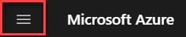
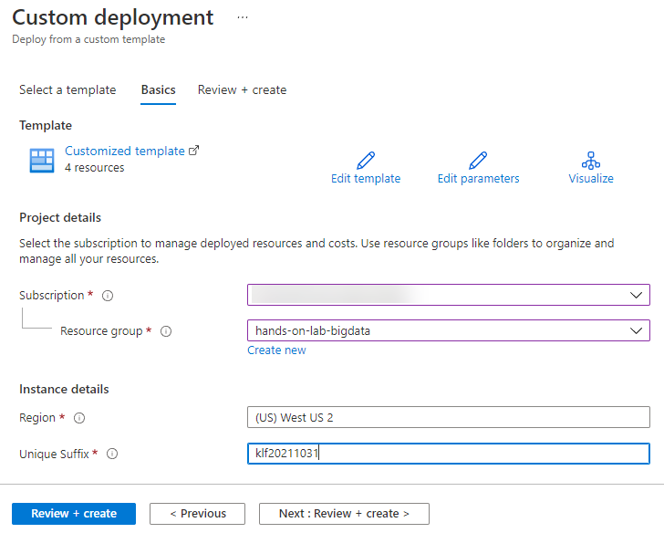
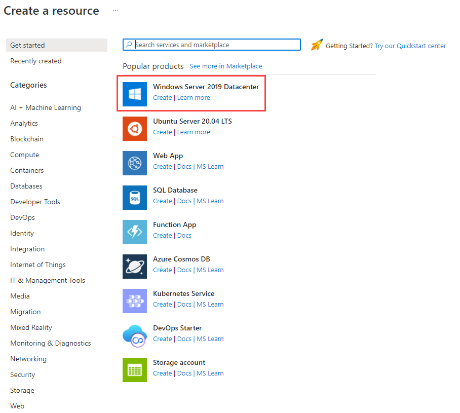
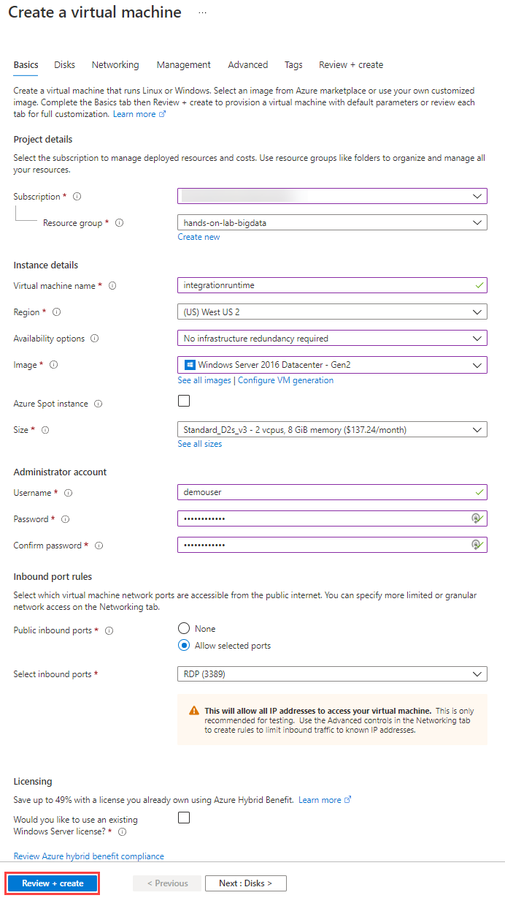
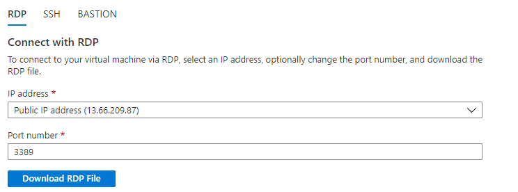
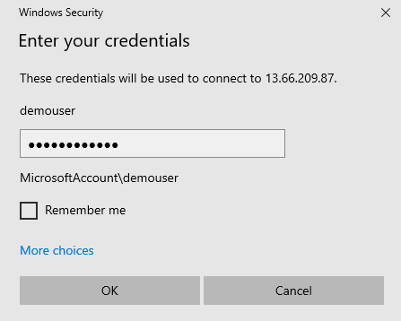
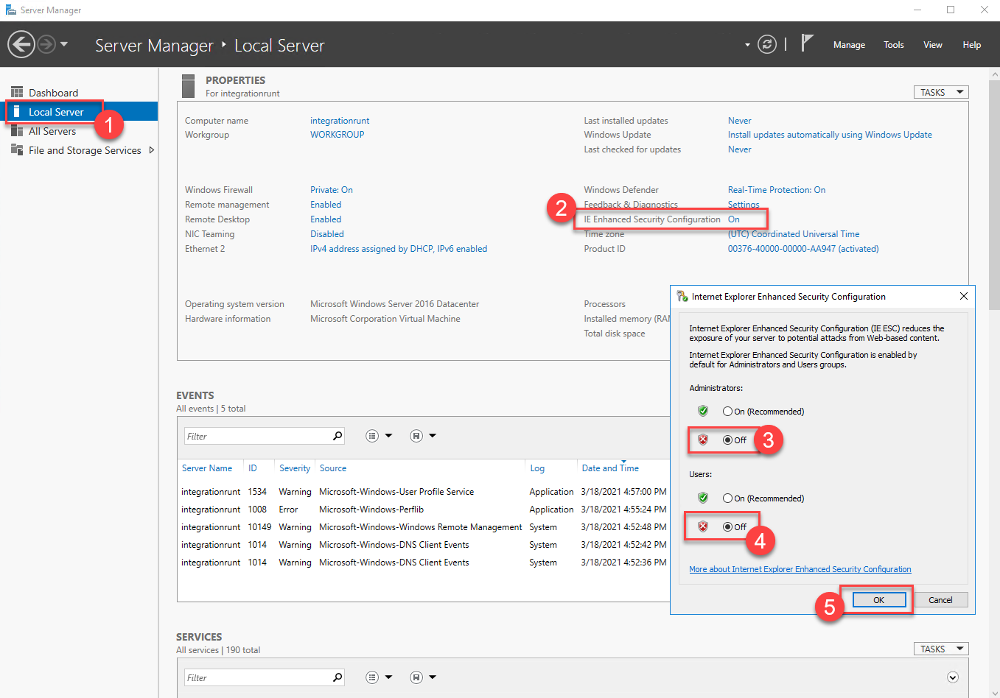

# Big data analytics and visualization

## Before the hands-on lab setup guide

**Contents**

<!-- TOC -->

- [Big data analytics and visualization before the hands-on lab setup guide](#big-data-analytics-and-visualization-before-the-hands-on-lab-setup-guide)
  - [Requirements](#requirements)
  - [Before the hands-on lab](#before-the-hands-on-lab)
    - [Task 1: Create an Azure resource group using the Azure Portal](#task-1-create-an-azure-resource-group-using-the-azure-portal)
    - [Task 2: Deploy Azure resources](#task-2-deploy-azure-resources)
    - [Task 3: Download and install Power BI Desktop](#task-3-download-and-install-power-bi-desktop)
    - [Task 4: (Optional) Provision a VM to install the Integration Runtime On](#task-4-optional-provision-a-vm-to-install-the-integration-runtime-on)

<!-- /TOC -->

# Big data analytics and visualization before the hands-on lab setup guide

## Requirements

1. Microsoft Azure subscription must be pay-as-you-go or MSDN.

   - Trial subscriptions will not work.

2. If you are not a Service Administrator or Co-administrator for the Azure subscription, or if you are running the lab in a hosted environment, you will need to install [Visual Studio 2019 Community](https://visualstudio.microsoft.com/downloads/) with the **ASP.NET and web development** and **Azure development** workloads.

## Before the hands-on lab

Duration: 30 minutes

In this exercise, you will set up your environment for use in the rest of the hands-on lab. You should follow all the steps provided in the Before the Hands-on Lab section to prepare your environment _before_ attending the hands-on lab.

### Task 1: Create an Azure resource group using the Azure Portal

In this task, you will use the Azure Portal to create a new Azure Resource Group for this lab.

1. Log into the [Azure Portal](https://portal.azure.com).

2. On the top-left corner of the portal, select the menu icon to display the menu.

    

3. In the left-hand menu, select **Resource Groups**.

4. At the top of the screen select the **+ New** option to add a new resource group.

   

5. Create a new resource group with the name **hands-on-lab-bigdata**, ensuring that the proper subscription and region nearest you are selected.  Once you have chosen a location, select **Review + Create**.

   

6. On the Summary blade, select **Create** to provision your resource group.

### Task 2: Deploy Azure resources

The below ARM template deploys several Azure resources for the labs.

1. Deploy the workspace through the following Azure ARM template (select the button below):

    

2. On the **Custom deployment** form fill in the fields described below.

   - **Subscription**: Select your desired subscription for the deployment.
   - **Resource group**: Select the resource group you previously created.
   - **Region**: The region where your Azure resources will be created.

   - **Unique Suffix**: This unique suffix will be used naming resources that will be created as part of your deployment, such as your initials followed by the current date in YYYYMMDD format (ex. `klf20211031`). Make sure you follow correct Azure [Resource naming](https://docs.microsoft.com/en-us/azure/cloud-adoption-framework/ready/azure-best-practices/naming-and-tagging#resource-naming) conventions.

   

3. Select the **Review + create** button, then **Create**. The provisioning of your deployment resources will take approximately 5 minutes.

### Task 3: Download and install Power BI Desktop

Power BI desktop is required to connect to your Azure Databricks environment when creating the Power BI dashboard.

1. Download and install [Power BI Desktop](https://powerbi.microsoft.com/desktop/).

### Task 4: (Optional) Provision a VM to install the Integration Runtime On

An integration runtime agent for Azure Data Factory will need to be installed on your hardware for the hands-on lab. Since you will need to provide your user credentials, we suggest you provision an Azure VM to act as your "on-premises" hardware.

1. In the [Azure Portal](https://portal.azure.com) (<https://portal.azure.com>), select **Create a resource** within the portal menu.

   

2. Select **Windows Server 2019 Datacenter** from Azure Marketplace.

   

3. On the **Create a virtual machine** page, specify the following parameters:

   - **Subscription**: Provide the subscription you have been using for this lab.

   - **Resource group**: Provide your resource group.

   - **Virtual machine name**: Provide something descriptive.

   - **Region**: Provide the same location as your ADF instance.

   - **Availability options**: No infrastructure redundancy required

   - **Image**: Windows Server 2016 Datacenter - Gen2

   - **Azure Spot instance**: Unselected

   - **Size**: Standard_D2s_v3

   - **Username**: demouser

   - **Password/Confirm password**: Password.1!!

   - **Public inbound ports**: Allow selected ports

   - **Select inbound ports**: RDP (3389)

   - **Would you like to use an existing Windows Server license?** No

   

4. select **Review + create** to proceed.

5. Select **Create** on the validation page to finish and start provisioning your VM. When the deployment is complete **(1)**, select **Go to resource (2)** to navigate to your VM.

   

6. Select **Connect** from the upper left-hand corner of the page. Then, select **RDP**. Finally, select **Download RDP File**.

   

7. Open the RDP file. Enter the username and password you configured earlier. Disregard any certificate issues that RDP presents.

   

8. When you access the VM, **Server Manager** should open automatically. If not, open it manually using the search bar. Then, locate **Local Server**. Select **IE Enhanced Security Configuration**. Then, disable this feature for Administrators.

   

You should follow all these steps provided _before_ attending the Hands-on lab.
